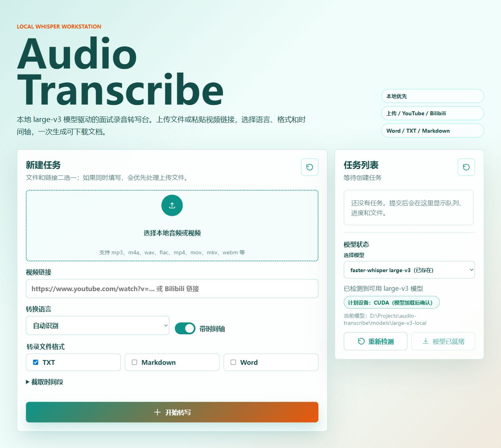

# Audio-Transcribe

Audio-Transcribe 是一个本地优先的音视频转写桌面工作台。它在本机启动一个本地网页应用，用于上传音频、视频或粘贴视频链接，然后使用本地 Whisper / MLX Whisper / Ollama 工作流完成转写、整理、导出和复查。



## 1. 项目简介

Audio-Transcribe 适合处理面试录音、会议音频、课程视频、YouTube / Bilibili 链接和本地素材。项目默认优先保留原始转写文本，文本整理、翻译、会议纪要和本地大模型能力都是可选增强。

主要能力：

- 上传本地音频或视频文件，支持 `mp3`、`m4a`、`wav`、`flac`、`aac`、`ogg`、`mp4`、`mov`、`mkv`、`webm`、`avi`。
- 粘贴 `yt-dlp` 支持的视频链接并抽取音频。
- 自动清理 YouTube 链接中的时间参数，避免链接任务卡在准备阶段。
- 支持自动识别、中文、日语、英语、韩语。
- 支持 TXT、Markdown、JSON、SRT、Word 导出。
- 支持原始文本、整理后文本、原始加整理后三种导出范围。
- 支持模型检测、模型下载进度、下载取消、CUDA 失败后的 CPU 降级提示。
- 支持稳定 Whisper、Apple Silicon 推荐的 MLX Whisper、实验性 Ollama 本地大模型音频转录。
- 支持 Ollama 文本整理，内置标点修复、保守清理、日语自然断句、中文会议纪要、双语翻译。
- 支持原始文本和整理后文本同屏展示、复制、重新整理、段落级对比。
- 支持任务耗时、错误诊断、事件时间线和最近任务历史。

## 2. 安装方式

### 🟢 推荐方式：安装器版本

安装器版本面向普通用户，是最接近“像普通软件一样安装和使用”的方式。

下载位置：

- Windows 安装器：`AudioTranscribeSetup.exe`
- macOS 安装器：`AudioTranscribe.dmg`

推荐原因：

- 安装后可从桌面快捷方式、开始菜单或应用程序目录启动。
- Windows 安装器目标是随包携带 Python runtime，并自动创建卸载入口。
- macOS 安装器目标是提供 `.app` 应用包和 `.dmg` 拖拽安装体验。
- 安装器会写入默认配置文件，方便后续升级为真正的一键桌面应用。

当前阶段说明：

- Windows 安装器构建依赖 Inno Setup，构建入口是 `scripts/build-release.ps1 -Target installer-windows`。
- macOS 安装器构建依赖 macOS 的 `hdiutil`，构建入口是 `scripts/build-release.ps1 -Target installer-macos`。
- 如果构建机没有准备 Python runtime、FFmpeg 或安装器工具，构建脚本会用中文报错，不会生成误导性的安装包。

### 🟡 便携版（ZIP）

便携版适合开发者、测试用户、临时使用或不想安装软件的用户。

下载位置：

- Windows 便携版：`AudioTranscribe-v版本号-windows-x64.zip`
- macOS 便携版：`AudioTranscribe-v版本号-macos.zip`

使用方式：

1. 下载对应系统的 ZIP。
2. 解压到一个普通目录。
3. Windows 双击 `start-audio-transcribe.bat`。
4. macOS 双击 `start-audio-transcribe.command`。
5. 浏览器会打开 `http://127.0.0.1:8000/`。

macOS 如果提示无法打开，进入解压目录后执行：

```bash
chmod +x scripts/setup-macos.sh start-audio-transcribe.command stop-audio-transcribe.command
```

## 3. 是否真正开箱即用

必须透明说明：

- ZIP 便携版是“半开箱即用”。它包含项目文件、启动脚本和中文引导，但仍依赖本机 Python 和 FFmpeg，首次启动可能需要安装 Python 依赖。
- Windows 安装器版本的目标是“尽量全自动”。当构建机提供 Python runtime 和 FFmpeg 时，安装包可以随包携带运行环境。
- macOS 安装器版本的目标是“拖拽安装”。如果无法合法或稳定地随包携带某些系统依赖，首次运行会显示中文引导。
- Whisper、MLX Whisper、Ollama 模型体积较大，仓库和发行包默认不内置模型。首次使用时请在页面中下载或手动放置模型。

## 4. 环境依赖

基础依赖：

- Python：建议 Python 3.10 或更新版本。
- FFmpeg / FFprobe：用于音视频预处理、读取媒体时长和抽取音频。
- 浏览器：用于打开本地网页界面。

可选依赖：

- Ollama：用于本地大模型音频转录和文本整理。
- MLX Whisper：Apple Silicon Mac 可选，适合本地加速转写。
- CUDA：Windows 或 Linux 上可选，配置正确时 faster-whisper 可以使用显卡。

Windows FFmpeg 处理方式：

- 安装 FFmpeg，并确保 `ffmpeg` 和 `ffprobe` 可以在命令行中直接运行。
- 或把 `ffmpeg.exe` 和 `ffprobe.exe` 放到项目目录的 `origin-code/`。

macOS FFmpeg 推荐安装方式：

```bash
brew install ffmpeg
```

## 5. 首次启动流程

Windows：

1. 双击 `start-audio-transcribe.bat`。
2. 启动器检查本地服务是否已经运行。
3. 启动器检查 Python runtime 或 `.venv`。
4. 如果没有虚拟环境，启动器会调用 `scripts\setup-windows.ps1` 创建环境并安装依赖。
5. 启动器检查 Python 依赖和 FFmpeg。
6. 检查通过后启动本地服务。
7. 浏览器打开 `http://127.0.0.1:8000/`。

macOS：

1. 双击 `start-audio-transcribe.command`。
2. 启动器检查 `.venv`。
3. 如果没有虚拟环境，启动器会调用 `scripts/setup-macos.sh` 创建环境并安装依赖。
4. 启动器检查 Python 依赖和 FFmpeg。
5. 检查通过后启动本地服务。
6. 浏览器打开 `http://127.0.0.1:8000/`。

如果依赖缺失，启动器不会直接崩溃，会显示中文安装步骤。按提示处理后重新双击启动即可。

## 6. 常见问题

### 页面打不开

确认启动窗口仍在运行，并手动打开：

```text
http://127.0.0.1:8000/
```

如果仍打不开，查看启动窗口中的中文错误提示，通常是 Python、FFmpeg、端口占用或模型路径问题。

### 提示缺少 Python

Windows 请安装 Python 3.10 或更新版本，并在安装时勾选加入系统路径。macOS 推荐使用：

```bash
brew install python
```

### 提示缺少 FFmpeg

Windows 请安装 FFmpeg，或把 `ffmpeg.exe` 和 `ffprobe.exe` 放到 `origin-code/`。macOS 推荐：

```bash
brew install ffmpeg
```

### 端口被占用

Audio-Transcribe 默认使用 `127.0.0.1:8000`。如果提示端口占用，请先关闭占用端口的程序，或运行停止脚本。

### 模型未配置

进入页面右侧模型区选择 faster-whisper 模型并确认下载。也可以手动把模型放到 `models/<模型名>-local/`，或用 `AUDIO_TRANSCRIBE_MODEL_PATH` 指向已有模型目录。

### Mac 上 large-v3 很慢

`large-v3` 体积大，在 MacBook Air 等设备上可能很慢。日常建议先用 `small` 或 `medium`。Apple Silicon Mac 可以考虑配置 MLX Whisper。

### Ollama 文本整理失败

原始转写文本会保留。可以先确认 Ollama 已运行，再切换到更小模型或更保守的整理配置。

## 7. 关闭方式

Windows：

- 在启动窗口按 `Ctrl + C`，如果 Windows 询问是否终止批处理操作，输入 `Y`。
- 或直接关闭启动窗口。
- 或双击 `stop-audio-transcribe.bat`。

macOS：

- 回到启动时打开的 Terminal 窗口，按 `Control + C`。
- 或关闭该 Terminal 窗口。
- 或双击 `stop-audio-transcribe.command`。

## 8. Release 下载说明

推荐优先级：

1. 优先下载安装器版本。普通用户优先选择 `AudioTranscribeSetup.exe` 或 `AudioTranscribe.dmg`。
2. 如果只是临时试用、调试或不想安装软件，再选择 ZIP 便携版。
3. 如果你要开发或修改项目，可以直接 clone 源码。

ZIP 与安装器差异：

| 类型 | 文件 | 适合用户 | 是否安装 | 依赖处理 |
| --- | --- | --- | --- | --- |
| Windows 安装器 | `AudioTranscribeSetup.exe` | 普通 Windows 用户 | 是 | 目标是随包携带 Python runtime，并创建快捷方式和卸载入口 |
| macOS 安装器 | `AudioTranscribe.dmg` | 普通 macOS 用户 | 拖拽安装 | 目标是提供 `.app` 应用包，Apple Silicon 优先支持 MLX Whisper |
| Windows ZIP | `AudioTranscribe-v版本号-windows-x64.zip` | 测试和便携用户 | 否 | 需要本机 Python / FFmpeg，启动器会中文引导 |
| macOS ZIP | `AudioTranscribe-v版本号-macos.zip` | 测试和便携用户 | 否 | 需要本机 Python / FFmpeg，启动器会中文引导 |

## 9. 发行路线

- `v0.2.x`：开发版，重点修正 ZIP 误导说明，并引入双发行体系骨架。
- `v0.9.x`：安装器测试版，重点验证 Windows 安装器和 macOS dmg。
- `v1.0.0`：正式桌面应用，目标是普通用户可按安装器方式稳定使用。

详细规划见 [docs/release-notes/v1.0-roadmap.md](docs/release-notes/v1.0-roadmap.md)。

## 10. 构建发行包

Windows PowerShell：

```powershell
.\scripts\build-release.ps1 -Version v0.2.1 -Target zip
.\scripts\build-release.ps1 -Version v0.2.1 -Target installer-windows
```

macOS PowerShell：

```powershell
./scripts/build-release.ps1 -Version v0.2.1 -Target zip
./scripts/build-release.ps1 -Version v0.2.1 -Target installer-macos
```

构建输出目录：

```text
dist/
  zip/
    windows/
    macos/
  installer/
    windows/
    macos/
```

构建脚本不会批量删除旧产物。如果目标目录已经存在，会停止并要求手动处理。

## 11. 本地模型

仓库和发行包默认不内置 Whisper 模型。模型体积较大，首次运行后请在页面右侧选择模型并点击下载，也可以手动下载并放入 `models/`。

常见目录示例：

```text
models/
  small-local/
    config.json
    model.bin
    tokenizer.json
    vocabulary.txt
```

可用环境变量：

```bash
AUDIO_TRANSCRIBE_MODEL_PATH=/path/to/model
AUDIO_TRANSCRIBE_DEVICE=auto
AUDIO_TRANSCRIBE_COMPUTE_TYPE=auto
OLLAMA_BASE_URL=http://localhost:11434
```

## 12. 开发和测试

开发模式：

```bash
source .venv/bin/activate
pip install -r requirements.txt
uvicorn app.main:app --host 127.0.0.1 --port 8000
```

Mock 模式：

```bash
AUDIO_TRANSCRIBE_MOCK=1 .venv/bin/uvicorn app.main:app --reload
```

Mock 模式不会调用真实 Whisper 或 Ollama，适合验证页面流程、错误提示和导出逻辑。
