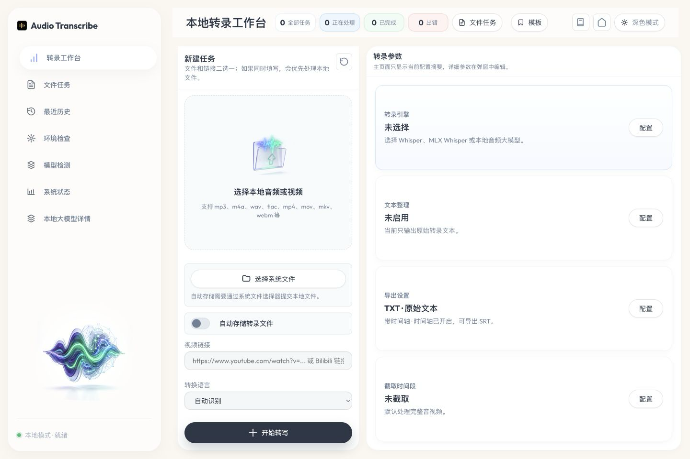
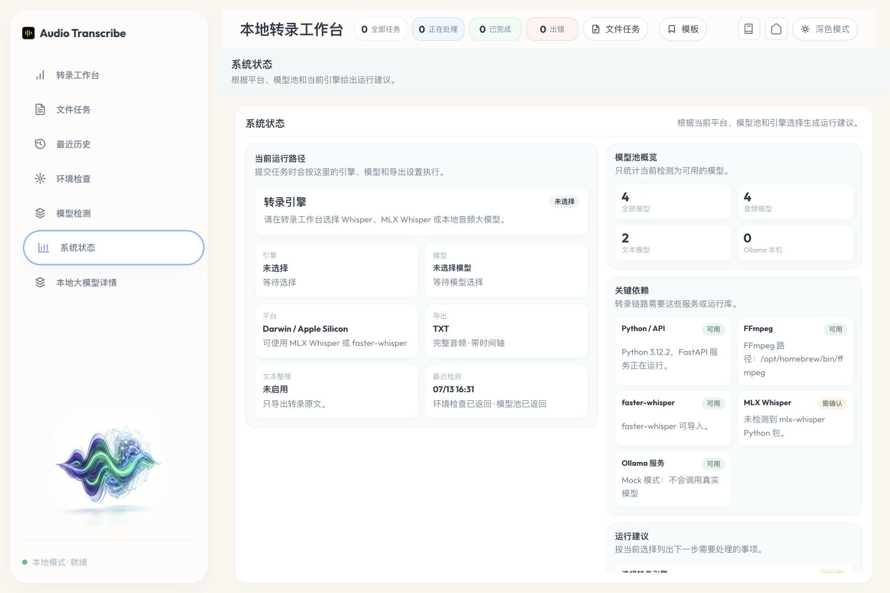

# Audio-Transcribe

Audio-Transcribe 是一个本地优先的音视频转写桌面工作台。它在本机启动网页界面，用于处理本地音频、视频和 `yt-dlp` 支持的链接，并通过 Whisper、MLX Whisper、MLX Audio / VLM Audio 与 Ollama 等本地工作流完成转写、音频理解、文本整理、导出和复查。音频、转写文本和模型默认都留在本机。






## 1. 项目简介

Audio-Transcribe 适合处理面试录音、会议音频、课程视频、YouTube / Bilibili 链接和本地素材。项目默认优先保留原始转写文本，文本整理、翻译、会议纪要和本地大模型能力都是可选增强。

主要能力：

- 上传本地音频或视频文件，支持 `mp3`、`m4a`、`wav`、`flac`、`aac`、`ogg`、`mp4`、`mov`、`mkv`、`webm`、`avi`。
- 粘贴 `yt-dlp` 支持的视频链接并抽取音频。
- 自动清理 YouTube 链接中的时间参数，避免链接任务卡在准备阶段。
- 支持自动识别、中文、日语、英语、韩语。
- 支持 TXT、Markdown、JSON、SRT、Word 导出。
- 支持原始文本、整理后文本、原始加整理后三种导出范围。
- 支持模型检测、模型下载进度、下载取消、CUDA 失败后的 CPU 降级提示。
- 支持稳定 Whisper、Apple Silicon 推荐的 MLX Whisper、MLX Audio / VLM Audio 多模态音频理解，以及已检测到的 Ollama / 本地音频模型。
- 支持本地大模型文本整理，内置标点修复、保守清理、日语自然断句、中文会议纪要、双语翻译、Repair 文本修复和说话人识别。
- 说话人识别会根据分段时间、停顿、问答关系和语言逻辑推断发言轮次，并统一使用 `说话人 1：`、`说话人 2：` 这类命名。
- 支持原始文本和整理后文本同屏展示、复制、重新整理、段落级对比；对比视图会保留展开状态，不会被任务轮询刷新打断。
- 支持任务耗时、错误诊断、事件时间线和最近任务历史。
- 支持右侧任务卡片单独展开/收起，适合连续处理多个长音频任务。
- 支持清理 `data/jobs` 下已结束任务遗留的 source 音频、chunk、中间文件和导出文件，释放本地磁盘空间；运行中的任务不会被清理。
- 提供独立“系统状态”页，集中展示当前转录路径、可用模型数量、平台、导出配置、关键依赖与运行建议。
- Ollama、MLX、Hugging Face 缓存、llama.cpp 和自定义目录会并行检测；模型池使用短时缓存降低重复扫描开销。

## 2. 安装方式

### 最新推荐版本

当前推荐发布版本：`v0.4.0`。

下载地址：[GitHub Releases](https://github.com/ChestnutleeEd/audio-transcribe/releases/latest)

普通用户优先下载安装器；开发者、测试用户或临时试用再下载 ZIP。源码启动、ZIP 启动和安装器启动都会走同一套本地服务，默认打开：

```text
http://127.0.0.1:8000/
```

### 🟢 推荐方式：安装器版本

安装器版本面向普通用户，是最接近“像普通软件一样安装和使用”的方式。

下载位置：

- Windows 安装器：`AudioTranscribeSetup.exe`
- macOS 安装器：`AudioTranscribe.dmg`

推荐原因：

- 安装后可从桌面快捷方式、开始菜单或应用程序目录启动。
- Windows 安装器随包携带可再发行 Python 3.12、项目依赖、FFmpeg / FFprobe，并自动创建快捷方式和卸载入口。
- macOS 安装器提供 Apple Silicon `.app` 与 `.dmg` 拖拽安装体验，同样内置 Python 运行时和媒体工具。
- 启动器仍会执行运行检查；如果 Python 包不完整，会默认通过清华 PyPI 镜像自动补齐。

当前阶段说明：

- Windows 安装器构建依赖 Inno Setup，构建入口是 `scripts/build-release.ps1 -Target installer-windows`。
- macOS 安装器构建依赖 macOS 的 `hdiutil`，构建入口是 `scripts/build-release.ps1 -Target installer-macos`。
- Release 工作流只有在内置运行时、FFmpeg、测试和产物体积检查全部通过后才会发布；缺失安装器工具时不会生成假文件。

### 🟡 便携版（ZIP）

便携版适合不想安装软件、临时使用或需要把程序放在独立目录中的用户；`v0.4.0` 起同样内置基础运行环境。

下载位置：

- Windows 便携版：`AudioTranscribe-v版本号-windows-x64.zip`
- macOS 便携版：`AudioTranscribe-v版本号-macos.zip`

使用方式：

1. 下载对应系统的 ZIP。
2. 解压到一个普通目录。
3. Windows 双击 `start-audio-transcribe.bat`。
4. macOS 双击 `start-audio-transcribe.command`。
5. 浏览器会打开 `http://127.0.0.1:8000/`。

macOS ZIP 使用 `ditto` 构建并保留可执行权限。如果系统仍因下载隔离提示无法打开，进入解压目录后执行：

```bash
chmod +x scripts/setup-macos.sh start-audio-transcribe.command stop-audio-transcribe.command
```

## 3. 开箱即用清单

发行包说明：

- Windows 安装器和 ZIP 均内置 Windows x64 Python 3.12、基础 Python 依赖、FFmpeg 与 FFprobe。
- macOS DMG 和 ZIP 均在 Apple Silicon GitHub 构建机上生成，内置 arm64 Python 3.12、基础 Python 依赖、FFmpeg 与 FFprobe。
- ZIP 解压后可直接运行启动器，不依赖系统 Python 或系统 FFmpeg。
- 源码启动适合开发者。首次运行 `start-audio-transcribe.bat` 或 `start-audio-transcribe.command` 时，会自动创建 `.venv` 并安装 `requirements.txt`。
- 启动脚本默认使用清华 PyPI 镜像：`https://pypi.tuna.tsinghua.edu.cn/simple`。如需切换，可先设置 `PIP_INDEX_URL`。
- Whisper、MLX Whisper、MLX Audio / VLM Audio、Ollama 模型体积较大，仓库和发行包默认不内置模型。首次使用时请在页面中下载、通过对应模型管理器准备，或绑定已有本地目录。

### Windows 开箱即用路径

1. 优先下载 `AudioTranscribeSetup.exe` 并按提示安装；无需另装 Python 或 FFmpeg。
2. 如果使用 ZIP，解压后双击 `start-audio-transcribe.bat`。
3. 启动器会检查 Python runtime、`.venv`、Python 依赖、FFmpeg / FFprobe 和端口占用。
4. 正式 Release 已内置 Python 与 FFmpeg；源码启动时如依赖不完整，启动器会通过清华 PyPI 镜像补齐 Python 包。
5. 只有源码环境缺少系统级 Python / FFmpeg 且自动准备失败时，才需要按中文提示手动安装。

### macOS 开箱即用路径

1. Apple Silicon Mac 优先下载 `AudioTranscribe.dmg`；无需另装 Python 或 FFmpeg。
2. 如果使用 ZIP，解压后双击 `start-audio-transcribe.command`。
3. 启动器会优先使用包内 `.runtime/python` 与 `origin-code/ffmpeg`，并检查依赖和端口占用。
4. 源码启动缺少 Python 或 FFmpeg 时，推荐使用 Homebrew 安装：

```bash
brew install python ffmpeg
```

5. 国内网络可使用镜像加速 Homebrew bottle 下载：

```bash
export HOMEBREW_API_DOMAIN=https://mirrors.tuna.tsinghua.edu.cn/homebrew-bottles/api
export HOMEBREW_BOTTLE_DOMAIN=https://mirrors.tuna.tsinghua.edu.cn/homebrew-bottles
brew install python ffmpeg
```

## 4. 环境依赖

基础依赖：

- Python：建议 Python 3.10 或更新版本。
- FFmpeg / FFprobe：用于音视频预处理、读取媒体时长和抽取音频。
- 浏览器：用于打开本地网页界面。

可选依赖：

- Ollama：用于本地大模型音频转录和文本整理。
- MLX Whisper：Apple Silicon Mac 可选，适合本地加速转写。
- Qwen2-Audio：Apple Silicon Mac 可选，适合本地多模态音频理解。需要自行安装 `mlx-audio` 并准备 `mlx-community/Qwen2-Audio-7B-Instruct-4bit` 或本地模型目录。
- CUDA：Windows 或 Linux 上可选，配置正确时 faster-whisper 可以使用显卡。

Windows FFmpeg 处理方式：

- 安装 FFmpeg，并确保 `ffmpeg` 和 `ffprobe` 可以在命令行中直接运行。
- 或把 `ffmpeg.exe` 和 `ffprobe.exe` 放到项目目录的 `origin-code/`。

macOS FFmpeg 推荐安装方式：

```bash
brew install ffmpeg
```

## 5. 首次启动流程

Windows：

1. 双击 `start-audio-transcribe.bat`。
2. 启动器检查本地服务是否已经运行。
3. 启动器检查 Python runtime 或 `.venv`。
4. 如果没有虚拟环境，启动器会调用 `scripts\setup-windows.ps1` 创建环境并安装依赖。
5. 启动器检查 Python 依赖和 FFmpeg。
6. 检查通过后启动本地服务。
7. 浏览器打开 `http://127.0.0.1:8000/`。

macOS：

1. 双击 `start-audio-transcribe.command`。
2. 启动器检查 `.venv`。
3. 如果没有虚拟环境，启动器会调用 `scripts/setup-macos.sh` 创建环境并安装依赖。
4. 启动器检查 Python 依赖和 FFmpeg。
5. 检查通过后启动本地服务。
6. 浏览器打开 `http://127.0.0.1:8000/`。

如果依赖缺失，启动器不会直接崩溃，会显示中文安装步骤。按提示处理后重新双击启动即可。

## 6. 常见问题

### 页面打不开

确认启动窗口仍在运行，并手动打开：

```text
http://127.0.0.1:8000/
```

如果仍打不开，查看启动窗口中的中文错误提示，通常是 Python、FFmpeg、端口占用或模型路径问题。

### 提示缺少 Python

Windows 请安装 Python 3.10 或更新版本，并在安装时勾选加入系统路径。macOS 推荐使用：

```bash
brew install python
```

### 提示缺少 FFmpeg

Windows 请安装 FFmpeg，或把 `ffmpeg.exe` 和 `ffprobe.exe` 放到 `origin-code/`。macOS 推荐：

```bash
brew install ffmpeg
```

### 端口被占用

Audio-Transcribe 默认使用 `127.0.0.1:8000`。如果提示端口占用，请先关闭占用端口的程序，或运行停止脚本。

### 模型未配置

进入页面右侧模型区选择 faster-whisper 模型并确认下载。也可以手动把模型放到 `models/<模型名>-local/`，或用 `AUDIO_TRANSCRIBE_MODEL_PATH` 指向已有模型目录。

### Qwen2-Audio 不可用

Qwen2-Audio 只走本地 MLX Audio，不使用 OpenAI API，也不会自动调用云端服务。Apple Silicon Mac 用户可按下面步骤准备：

```bash
source .venv/bin/activate
pip install -r requirements-qwen-audio.txt
huggingface-cli download --local-dir models/Qwen2-Audio-7B-Instruct-4bit mlx-community/Qwen2-Audio-7B-Instruct-4bit
```

然后在页面中选择 `Qwen2-Audio（MLX 多模态理解）`，模型路径填写：

```text
models/Qwen2-Audio-7B-Instruct-4bit
```

如果填写 `mlx-community/Qwen2-Audio-7B-Instruct-4bit` repo id，默认按离线缓存使用，避免运行时静默下载。确需首次下载时，请在应用外显式下载模型。

国内网络较慢时，可临时使用镜像源：

```bash
# Python 依赖
pip install -r requirements-qwen-audio.txt -i https://pypi.tuna.tsinghua.edu.cn/simple

# Qwen2-Audio 模型
HF_ENDPOINT=https://hf-mirror.com huggingface-cli download \
  --local-dir models/Qwen2-Audio-7B-Instruct-4bit \
  mlx-community/Qwen2-Audio-7B-Instruct-4bit

# 如果需要先安装 PowerShell 验证 release 脚本
HOMEBREW_NO_AUTO_UPDATE=1 \
HOMEBREW_API_DOMAIN=https://mirrors.tuna.tsinghua.edu.cn/homebrew-bottles/api \
HOMEBREW_BOTTLE_DOMAIN=https://mirrors.tuna.tsinghua.edu.cn/homebrew-bottles \
brew install powershell
```

### Mac 上 large-v3 很慢

`large-v3` 体积大，在 MacBook Air 等设备上可能很慢。日常建议先用 `small` 或 `medium`。Apple Silicon Mac 可以考虑配置 MLX Whisper。

### Ollama 文本整理失败

原始转写文本会保留。可以先确认 Ollama 已运行，再切换到更小模型或更保守的整理配置。

### 工作文件占用空间较大

每个任务会在 `data/jobs/<任务 ID>/` 下生成工作文件，包括上传或下载得到的 `source` 文件、标准化音频、Qwen2-Audio chunk、导出文件等。长音频和视频任务可能占用较多空间。

页面右侧任务列表顶部提供“清理过往任务工作文件”按钮。应用会先显示可清理的已结束任务数、文件数和预计释放空间，点击后会再次确认。清理只处理已完成、失败或已取消的任务目录；正在运行的任务不会被清理。

清理后，历史记录中的文本快照仍保存在浏览器本地；已删除的导出文件需要重新转录或重新整理后再生成。

## 7. 关闭方式

Windows：

- 在启动窗口按 `Ctrl + C`，如果 Windows 询问是否终止批处理操作，输入 `Y`。
- 或直接关闭启动窗口。
- 或双击 `stop-audio-transcribe.bat`。

macOS：

- 回到启动时打开的 Terminal 窗口，按 `Control + C`。
- 或关闭该 Terminal 窗口。
- 或双击 `stop-audio-transcribe.command`。

## 8. Release 下载说明

推荐优先级：

1. 优先下载安装器版本。普通用户优先选择 `AudioTranscribeSetup.exe` 或 `AudioTranscribe.dmg`。
2. 如果只是临时试用、调试或不想安装软件，再选择 ZIP 便携版。
3. 如果你要开发或修改项目，可以直接 clone 源码。

ZIP 与安装器差异：

| 类型 | 文件 | 适合用户 | 是否安装 | 依赖处理 |
| --- | --- | --- | --- | --- |
| Windows 安装器 | `AudioTranscribeSetup.exe` | 普通 Windows x64 用户 | 是 | 内置 Python 3.12、依赖、FFmpeg；创建快捷方式和卸载入口 |
| macOS 安装器 | `AudioTranscribe.dmg` | Apple Silicon Mac 用户 | 拖拽安装 | 内置 arm64 Python 3.12、依赖、FFmpeg 和 `.app` 应用包 |
| Windows ZIP | `AudioTranscribe-v版本号-windows-x64.zip` | 便携用户 | 否 | 内置运行环境，解压后双击 `.bat` |
| macOS ZIP | `AudioTranscribe-v版本号-macos.zip` | 便携用户 | 否 | 内置运行环境与可执行权限，解压后双击 `.command` |

最新发布说明：

- [v0.4.0](docs/release-notes/v0.4.0.md)：新增系统状态总览与并行模型检测，更新全套界面截图，并提供内置 Python / FFmpeg 的 Windows 与 Apple Silicon macOS 发行包。
- [v0.3.1](docs/release-notes/v0.3.1.md)：修复转录工作台滚动面板溢出和右侧底部空白。
- [v0.3.0](docs/release-notes/v0.3.0.md)：新增 Qwen2-Audio MLX 多模态音频理解 pipeline。

## 9. 发行路线

- `v0.4.x`：内置运行时发行版，完善系统状态、模型池、跨平台安装与自动更新能力。
- `v0.9.x`：安装器测试版，重点验证签名、公证和增量升级。
- `v1.0.0`：正式桌面应用，目标是普通用户可长期稳定使用并平滑升级。

详细规划见 [docs/release-notes/v1.0-roadmap.md](docs/release-notes/v1.0-roadmap.md)。

## 10. 构建发行包

Windows PowerShell：

```powershell
.\scripts\prepare-release-runtime.ps1 -Platform windows
.\scripts\build-release.ps1 -Version v0.4.0 -Target zip-windows
.\scripts\build-release.ps1 -Version v0.4.0 -Target installer-windows
```

macOS PowerShell：

```powershell
./scripts/prepare-release-runtime.ps1 -Platform macos
./scripts/build-release.ps1 -Version v0.4.0 -Target zip-macos
./scripts/build-release.ps1 -Version v0.4.0 -Target installer-macos
```

构建输出目录：

```text
dist/
  zip/
    windows/
    macos/
  installer/
    windows/
    macos/
```

`prepare-release-runtime.ps1` 从 python-build-standalone 获取可再发行 Python，Python 依赖优先使用清华 PyPI，FFmpeg 工具依赖优先使用 npmmirror。构建脚本不会批量删除旧产物；目标目录已经存在时会停止并要求手动处理。Windows 未检测到 Inno Setup 时会跳过 EXE；macOS 未检测到 `create-dmg` 时会 fallback 为真实 `.app` bundle ZIP，不会生成假安装包。

正式 Release 使用 [`.github/workflows/release.yml`](.github/workflows/release.yml) 在 Windows 与 Apple Silicon macOS 原生构建机上完成运行时准备、测试、打包、产物校验和发布。

## 11. 本地模型

仓库和发行包默认不内置 Whisper 模型。模型体积较大，首次运行后请在页面右侧选择模型并点击下载，也可以手动下载并放入 `models/`。

常见目录示例：

```text
models/
  small-local/
    config.json
    model.bin
    tokenizer.json
    vocabulary.txt
```

可用环境变量：

```bash
AUDIO_TRANSCRIBE_MODEL_PATH=/path/to/model
AUDIO_TRANSCRIBE_DEVICE=auto
AUDIO_TRANSCRIBE_COMPUTE_TYPE=auto
OLLAMA_BASE_URL=http://localhost:11434
```

Qwen2-Audio 可用环境变量：

```bash
AUDIO_TRANSCRIBE_QWEN_AUDIO_MODEL=/path/to/Qwen2-Audio-7B-Instruct-4bit
AUDIO_TRANSCRIBE_QWEN_AUDIO_PROMPT="Transcribe the audio in the original language. Return only the transcript."
AUDIO_TRANSCRIBE_QWEN_AUDIO_CHUNK_SECONDS=20
AUDIO_TRANSCRIBE_QWEN_AUDIO_OVERLAP_SECONDS=1
```

Qwen2-Audio 是长音频和视频输入的默认主 ASR pipeline。默认不会下载模型，也不会调用云 API；请先在应用外准备本地 MLX 模型目录。应用会优先使用 `AUDIO_TRANSCRIBE_QWEN_AUDIO_MODEL`，其次自动探测 `~/models/mlx-community/Qwen2-Audio-7B-Instruct-4bit`，也可以在页面输入框手动指定目录。未显式设置 `AUDIO_TRANSCRIBE_QWEN_AUDIO_ALLOW_DOWNLOAD=1` 时，Qwen 推理作用域会强制 `HF_HUB_OFFLINE=1`。

处理流程：

```text
Video / Audio -> FFmpeg normalize -> 16kHz mono WAV -> 15-30s chunks -> Qwen2-Audio MLX -> partial_results -> JSON
```

Qwen2-Audio pipeline 会先用 FFmpeg 抽取视频音轨或标准化音频为 16kHz 单声道 WAV，再按 15 到 30 秒 chunk 切分，支持 0 到 2 秒 overlap。每个 chunk 都保留全局时间轴；结果合并时使用 `common-prefix-suffix-boundary` 策略删除相邻 chunk 在 overlap 区间产生的重复前缀，并把展示时间轴推进到上一段结束后。任务运行时会把 `partial_results` 写入 job metadata，前端轮询任务状态即可逐步更新文本。

Qwen JSON 导出结构：

```json
{
  "segments": [
    {
      "start": 0.0,
      "end": 15.0,
      "text": "...",
      "chunk_id": 1
    }
  ],
  "full_text": "..."
}
```

## 12. 开发和测试

开发模式：

```bash
source .venv/bin/activate
pip install -r requirements.txt
uvicorn app.main:app --host 127.0.0.1 --port 8000
```

Mock 模式：

```bash
AUDIO_TRANSCRIBE_MOCK=1 .venv/bin/uvicorn app.main:app --reload
```

Mock 模式不会调用真实 Whisper 或 Ollama，适合验证页面流程、错误提示和导出逻辑。
